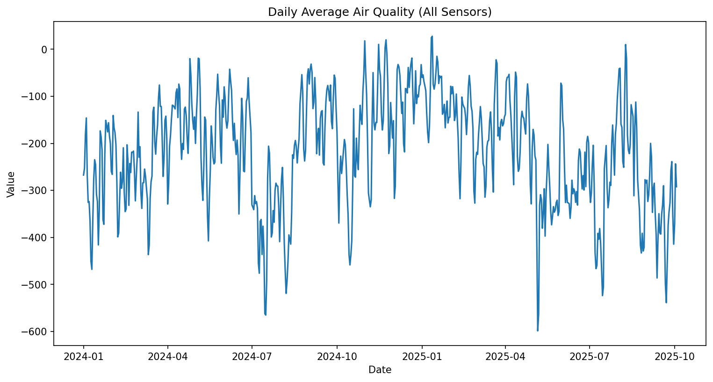
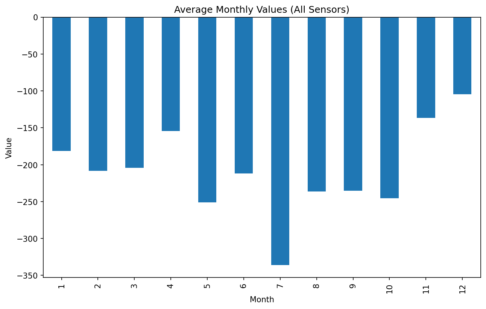

# 🌆 Milano Air Quality Analysis  

  
  

---

## 📊 Project Overview  
This project analyzes **air quality data from Milano** using open datasets from Regione Lombardia.  
We explore pollutant trends (PM10, NO2, O3), detect "bad air days", and build a simple forecast for PM10.  

The project combines **exploratory data analysis** with **time-series modeling** to extract insights that can support **public health and urban policy planning**.  

---

## 🧮 Methodology  

1. **Time-Series Aggregation**  
   - Daily average: `x̄_d = (Σ x_i) / n_d`  
   - Monthly average: `x̄_m = (Σ x_i) / n_m`  

2. **Threshold Detection (Bad Air Days)**  
   - Rule:  
     - If `PM10 > 50 µg/m³ → Bad Day = 1`  
     - Else → `Bad Day = 0`  

3. **Distribution Analysis**  
   - Histogram approximation of probability density:  
     - `p(x) ≈ (count in bin) / (N * Δx)`  

4. **Forecasting (Autoregressive Modeling)**  
   - AR model:  
     - `x_t = c + φ1 * x_(t-1) + φ2 * x_(t-2) + ... + φp * x_(t-p) + ε_t`  

---

## 📂 Dataset  
- Source: [Regione Lombardia – Dati sensori aria](https://www.dati.lombardia.it/Ambiente/Dati-sensori-aria/nicp-bhqi/about_data)  
- File: `data/air_quality.csv` (not included in repo due to size, please download from the link above)  

---

## 🛠️ How to Run  

1. Create a virtual environment:  
   ```bash
   python3 -m venv venv
   source venv/bin/activate   # Linux/Mac
   venv\Scripts\activate      # Windows
